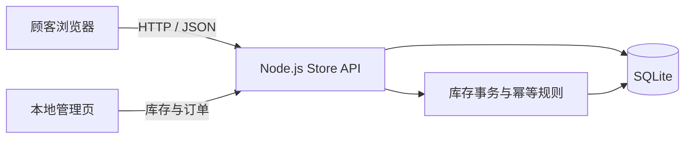
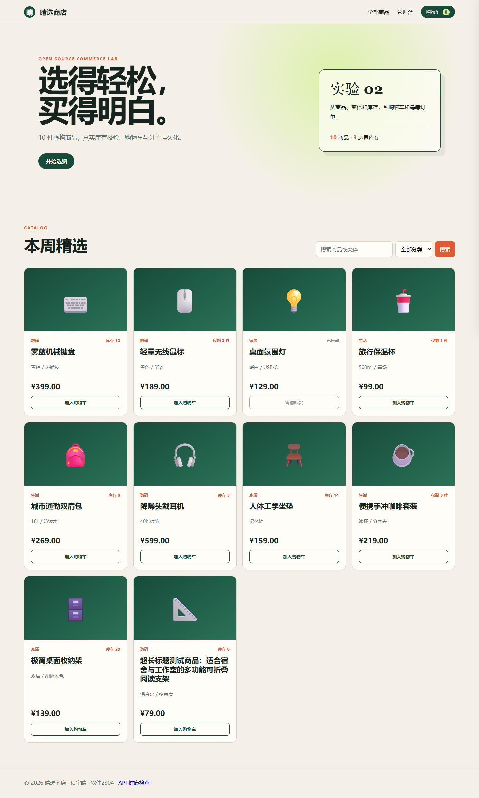
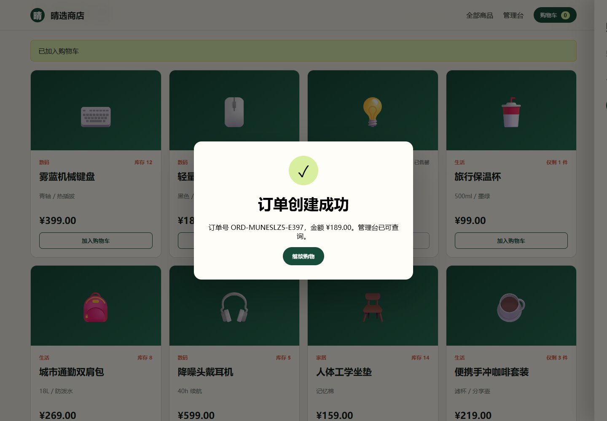

# 晴选商店：实验 2 开源在线商城系统二次开发

> 一个无需安装第三方依赖即可运行的教学商城，完成商品搜索、真实库存、购物车、结算、幂等订单和低库存提示闭环。

- 姓名：侯宇晴
- 学号：23120506154
- 班级：软件2304
- 店面：http://localhost:9100/
- 本地管理页：http://localhost:9100/admin

## 实现说明与边界

实验指导书建议使用 Medusa DTC Starter 固定提交 `19e8a6fbefea5a385e9502409908bfbebbecf526`。实施时 GitHub 443 连接失败，Docker Desktop 守护进程也无法启动，因此本仓库没有冒充 Medusa 全栈，而是使用 Node.js 22 内置 HTTP 与 SQLite API 完成同一组核心业务状态，作为可运行的教学复现版。

已实现：10 个商品、分类与搜索、商品变体信息、三种库存边界、购物车增删改、地址校验、库存事务扣减、订单持久化、`requestId` 幂等、防重复订单、本地订单管理页、低库存阈值配置。未实现：Medusa Admin、区域/配送模块、真实支付、客户登录和生产级权限。

## 架构



商品与变体在本实验中合并为一个可售 SKU；购物车持有商品 ID 和数量。创建订单时开启 `BEGIN IMMEDIATE` 事务，重新检查库存、扣减库存、写入订单及明细、清空购物车后再提交。相同 `requestId` 会返回原订单。

## 环境与启动

要求 Windows 11 和 Node.js 22.5+。本项目验证版本为 Node.js 22.14.0、npm 10.9.2；不需要 `npm install`。

```powershell
node --version
npm run seed
./scripts/Start-Store.ps1
```

停止：

```powershell
./scripts/Stop-Store.ps1
```

也可以前台运行 `npm start`。数据库生成在 `data/store.db`，已被 Git 忽略。`npm run seed` 会恢复 10 个商品并清空购物车和订单。

## Demo 流程

1. 打开店面，搜索“键盘”或选择“数码”。
2. 观察桌面氛围灯“已售罄”、无线鼠标“仅剩 2 件”。
3. 加入无线鼠标，在购物车修改数量；数量超过库存会收到错误。
4. 填写预置的虚构地址并提交订单。
5. 在成功弹窗记录订单号，再打开管理页查看订单和扣减后的库存。
6. 在管理页把低库存阈值从 3 改为 6，库存为 5 的耳机立即变为低库存。

## API 摘要

| 方法 | 路径 | 作用 |
| --- | --- | --- |
| GET | `/api/health` | 健康检查 |
| GET | `/api/products?q=&category=` | 商品搜索与分类 |
| GET | `/api/cart` | 当前 Cookie 购物车 |
| POST | `/api/cart/items` | 加入商品 |
| PATCH/DELETE | `/api/cart/items/:id` | 修改或删除行项目 |
| POST | `/api/orders` | 校验库存并创建幂等订单 |
| GET | `/api/admin/summary` | 本地库存和订单摘要 |
| PUT | `/api/admin/settings/low-stock` | 调整低库存阈值 |

更完整的请求字段和响应说明见 [`docs/api-summary.md`](docs/api-summary.md)。

## 测试

```powershell
npm test
```

当前 12 项自动测试全部通过，覆盖商品搜索、售罄、数量边界、购物车、地址校验、库存扣减、重复提交、阈值持久化和 HTTP Schema。22 条完整验收清单见 [`docs/test-report.md`](docs/test-report.md)。390px 浏览器实测 `innerWidth=scrollWidth=390`。

## Git 与个人贡献

仓库使用 `main` 和 `feature/store-extension`。至少 5 个非合并提交分别覆盖基线、业务核心、店面、自主功能/测试和文档。Issue 草稿在 [`docs/issue-low-stock.md`](docs/issue-low-stock.md)，PR 自审在 [`docs/pr-review.md`](docs/pr-review.md)。

## 数据恢复与安全

- `data/`、`.env`、日志、Token 和数据库口令不入库。
- `backup/store-export.sanitized.json` 只含商品、设置和脱敏订单摘要。
- 结算使用虚构地址，不收集真实支付信息。
- 管理页仅用于 localhost 演示，没有生产级认证，不应直接公网部署。

## 开源来源

实验指导基线：Medusa DTC Starter，MIT License，固定提交见上文。本实现未复制其源码，仅参考商品、购物车、库存和订单的业务概念。个人增量代码采用 MIT License。详细记录见 [`NOTICE.md`](NOTICE.md)。

## 截图




